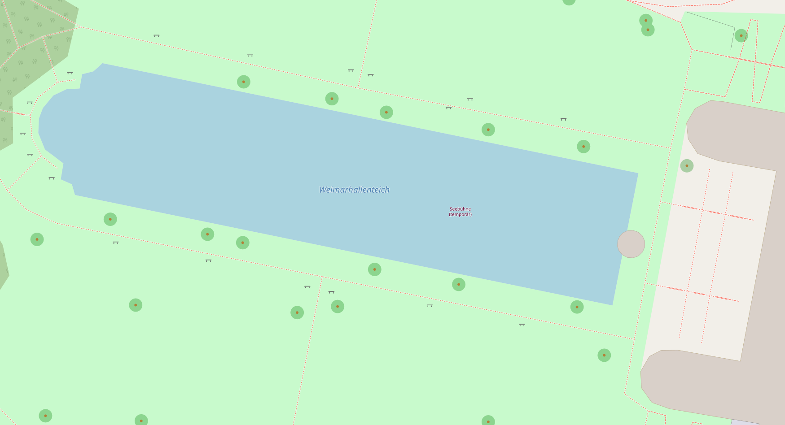

# Oster Hop in Weimar
## 17. April 2022

Wir treffen uns ab 15 Uhr am Pavillion im Weimarhallenpark beim Teich. Die "mobile Swingschleuder" sorgt für Lindy, Charleston und Balboa kompatible Beschallung. Unterm Dach des Pavillion ist glatter Steinboden.

